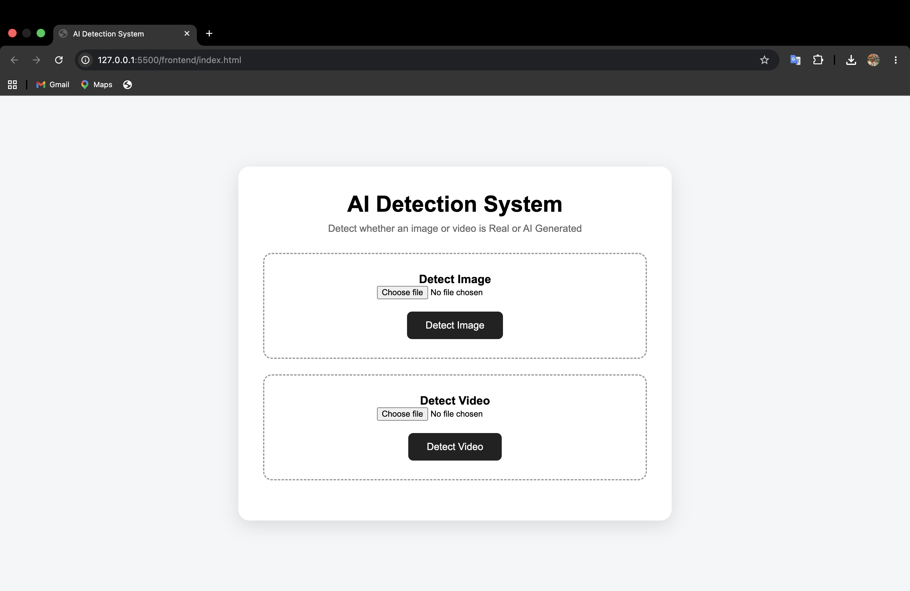

# AI-Generated Image and Video Detection System

A web-based application that detects whether an uploaded image or video is AI-generated or real. The system uses an AI-based detection model to analyze the uploaded media and provides a confidence percentage.

## Features

- Detects AI-generated images
- Detects AI-generated videos
- Displays AI and human confidence percentages
- Simple and user-friendly web interface
- FastAPI backend for processing files
- Supports image and video uploads

## Technologies Used

- Python
- FastAPI
- HTML
- CSS
- JavaScript
- OpenCV
- PyTorch
- Transformers
- Hugging Face

## Project Structure

AI-Detection-System/

├── backend/
│   ├── main.py
│   ├── video_detector.py
│   └── model/
│       └── detector.py
│
├── frontend/
│   ├── index.html
│   ├── script.js
│   └── style.css
│
├── test_images/
├── test_model.py
├── requirements.txt
├── .gitignore
└── README.md

## How It Works

1. User uploads an image or video.
2. The frontend sends the file to the FastAPI backend.
3. The backend processes the uploaded media.
4. The AI detection model analyzes the media.
5. The system calculates the detection confidence.
6. The result is displayed on the website.

## Installation

Clone the repository and install the required dependencies:

```bash
git clone https://github.com/Naveen60-del/AI-Generated-Image-and-Video-Detection.git
cd AI-Generated-Image-and-Video-Detection
python3 -m venv venv
source venv/bin/activate
pip install -r requirements.txt

## Screenshots

### Home Page



### AI Image Detection


### Real Image Detection


### Video Detection

